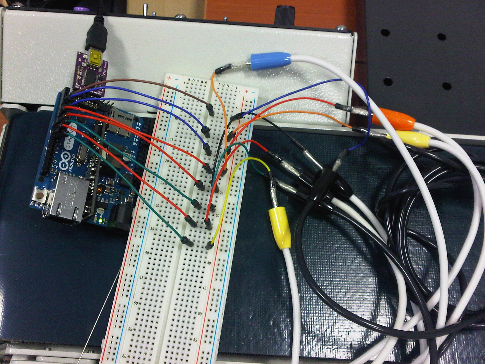
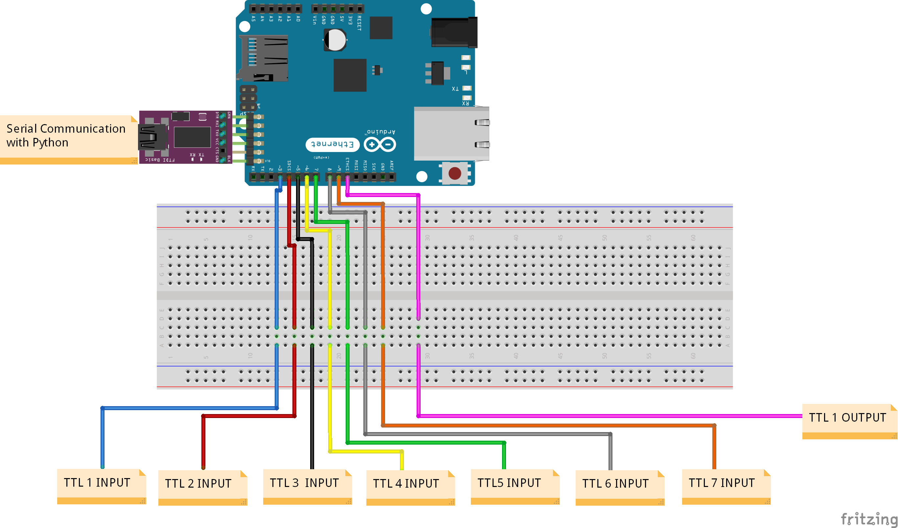
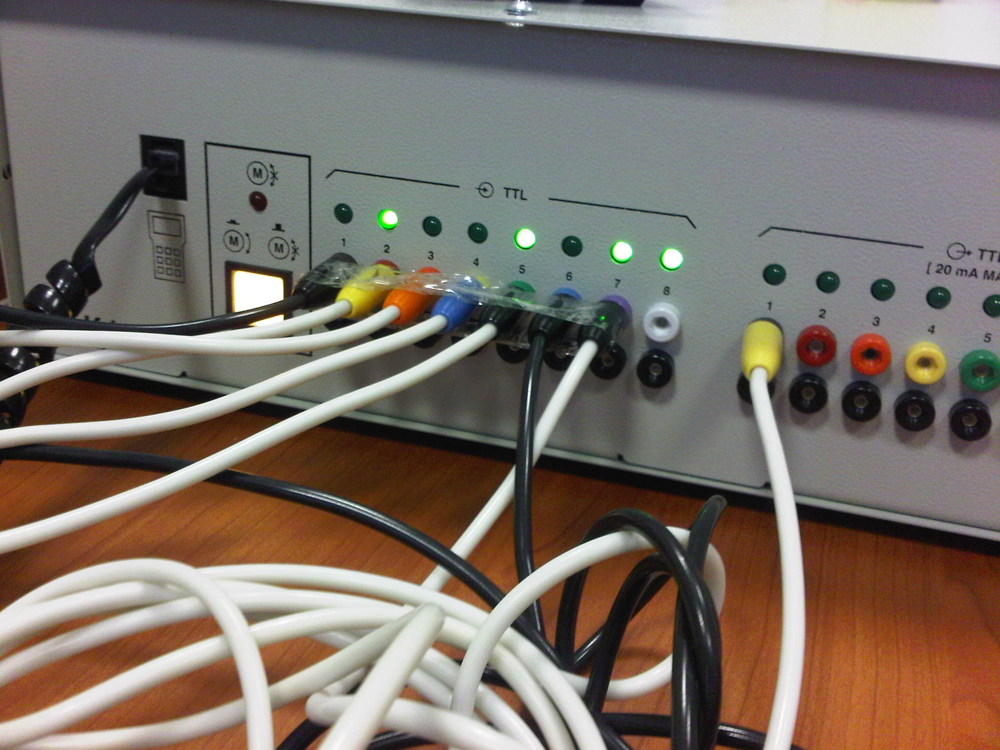
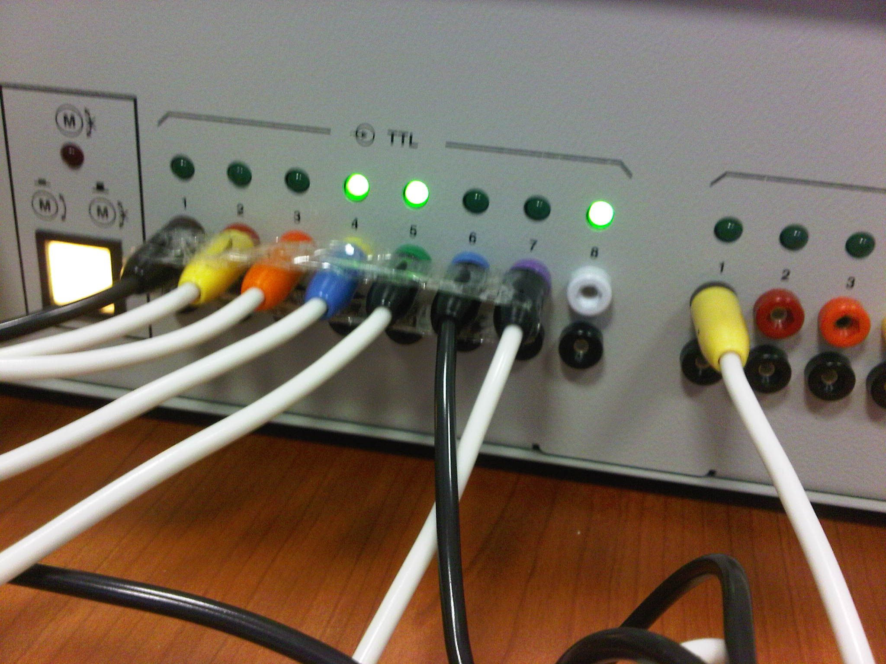
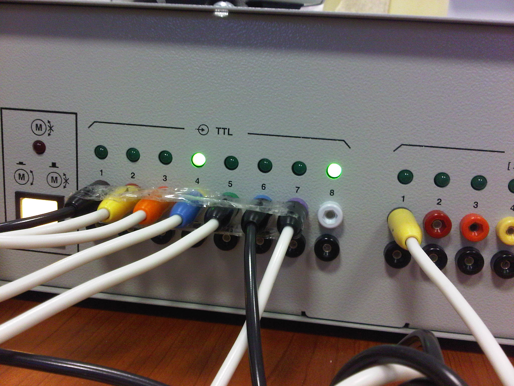
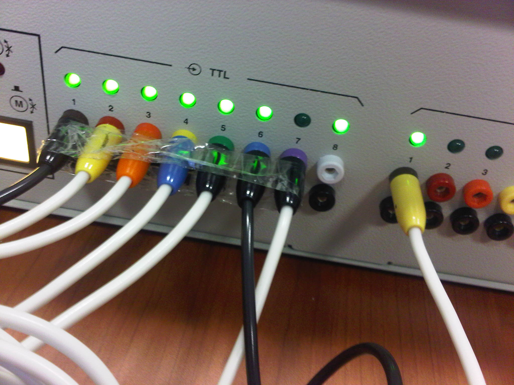

# RoboCIM Chessmaster #
Εργασία Ρομποτικής 2013-2014
Επιμέλεια:

 - Πετρουσόβ Ιωάννης 343
 - Λυμπερίδης Ευστάθιος
 - Μπάης Θοδωρής
 
-------------------------------------------

## Γενική Περιγραφή ##
Επίκεντρο της εργασίας ήταν ο ρομποτικός βραχίονας LabVolt 5250 τον οποίο προγραμματίσαμε με τέτοιο τρόπο ώστε ένας χρήστης να μπορεί να τον χειρίζεται για να παίζει σκάκι. Ο χρήστης δίνει τις εντολές μέσω ενός γραφικού περιβάλλοντος(σκακιέρας) από τον υπολογιστή, στη συνέχεια οι εντολές μεταβιβάζονται στο arduino και το arduino με τη σειρά του τις μεταβιβάζει στις TTL εισόδους του βραχίονα και εκτελείται η κίνηση.

## LabVolt 5250 - περιγραφή εντολών ##
Στον πρόγραμμα του βραχίονα έχουμε αποθηκεύσει όλα τα σημεία της σκακιέρας (64) και μία ουδέτερη θέση στην οποία θα πηγαίνει ο βραχίονας όταν είναι σε κατάσταση αναμονής για εντολή. Επίσης δύο εντολές χρησιμοποιούνται για το άνοιγμα και το κλείσιμο της δαγκάνας. Οπότε συνολικά 67 εντολές. Οι εντολές που δέχεται η μονάδα που ελέγχει τον βραχίονα είναι το λογικό 1 ή το λογικό 0 στις TTL εισόδους της. Επομένως η αναπαράσταση των εντολών είναι δυαδική. Ανάβοντας-σβήνοντας συγκεκριμένες εισοδους σχηματίζουμε τις παρακάτω εντολές.

|Σημεία σκακιέρας | Δεκαδική | Δυαδική εντολή
| -------------   |:-------------:|:----------:|
|grip open |  0  |  0 |
| A1 |  1  |  1 |
| A2 |  2  |  10 |
| A3|  3  |  11 |
| A4|  4  |  100 |
| A5|  5  |  101 |
|  A6|  6  |  110 |
| A7|  7  |  111 |
|  A8|  8  |  1000 |
|  B1|  9  |  1001 |
|  B2|  10  |  1010 |
|  B3|  11  |  1011 |
|  B4|  12  |  1100 |
|  B5|  13  |  1101 |
|  B6|  14  |  1110 |
|  B7|  15  |  1111 |
|  B8|  16  |  10000 |
|  C1|  17  |  10001 |
|  C2|  18  |  10010 |
|  C3|  19  |  10011 |
|  C4|  20  |  10100 |
|  C5|  21  |  10101 |
|  C6|  22  |  10110 |
|  C7|  23  |  10111 |
|  C8|  24  |  11000 |
|  D1|  25  |  11001 |
|  D2|  26  |  11010 |
|  D3|  27  |  11011 |
|  D4|  28  |  11100 |
|  D5|  29  |  11101 |
|  D6|  30  |  11110 |
|  D7|  31  |  11111 |
|  D8|  32  |  100000 |
|  E1|  33  |  100001 |
|  E2|  34  |  100010 |
|  E3|  35  |  100011 |
|  E4|  36  |  100100 |
|  E5|  37  |  100101 |
|  E6|  38  |  100110 |
|  E7|  39  |  100111 |
|  E8|  40  |  101000 |
|  F1|  41  |  101001 |
|  F2|  42  |  101010 |
|  F3|  43  |  101011 |
|  F4|  44  |  101100 |
|  F5|  45  |  101101 |
|  F6|  46  |  101110 |
|  F7|  47  |  101111 |
|  F8|  48  |  110000 |
|  G1|  49  |  110001 |
|  G2|  50  |  110010 |
|  G3|  51  |  110011 |
|  G4|  52  |  110100 |
|  G5|  53  |  110101 |
|  G6|  54  |  110110 |
|  G6|  55  |  110111 |
| G7|  56  |  111000 |
|  G8|  57  |  111001 |
|  H1|  58  |  111010 |
|  H2|  59  |  111011 |
|  H3|  60  |  111100 |
|  H4|  61  |  111101 |
|  H5|  62  |  111110 |
|  H6|  63  |  111111 |
|  H7|  64  |  1000000 |
|  H8|  65  |  1000001 |
| grip close|  127  |  1111111 |
| idle| 126 | 1111110 |

Συνεπώς το πρόγραμμα του βραχίονα ελέγχει τις εισόδους TTL εκτελώντας πολλές εντολές if και βρίσκει την εντολή που θέλουμε να εκτελέσουμε. O λόγος που έγινε έτσι η δομή είναι διότι οι εντολές του λογισμικού του βραχίονα είναι περιορισμένες. Με την ολοκλήρωση μίας κίνησης ο βραχίονας θα κινείται στην ουδέτερη θέση για να μη ρίξει τα υπόλοιπα πιόνα στη σκακιέρα.

## arduino: Arduino_Chess.ino - περιγραφή λειτουργίας ##
Ο κώδικας του arduino χρησιμοποιεί τις εξόδους 3, 4, 5, 6, 7, 8 και 9 στην πλακέτα για να στείλει τις εντολές τους χρήστη. Η έξοδος 10 χρησιμοποιείται σαν είσοδος για να μας ειδοποιεί πότε ο βραχίονας είναι απασχολημένος εκτελώντας κάποια εντολή. Οι εντολές λαμβάνονται από το πρόγραμμα ως ένας χαρακτήρας κάθε φορά και αποθηκεύονται σε μία λίστα γραμματοσειράς. Έπειτα περνώντας από μια συνάρτηση, ελέγχουμε τον κάθε χαρακτήρα και δημιουργούμε μια μεταβλητή που κρατάει σε μορφή byte την τελική εντολή. Αυτό επιστρέφετε στο κυρίως πρόγραμμα και το στέλνει στις εξόδους μέσο του temp. Το temp κάθε φορά κρατάει 1 bit που θα στείλει στην αντίστοιχη TTL κάνοντας μία λογική πρόσθεση με την εντολή και μια μάσκα με 1 στην θέση που θέλουμε και 0 στις υπόλοιπες. Αφού σταλεί η εντολή το arduino κάνει delay για 5 δευτερόλεπτα επιτρέποντας το Lab Volt να την αναγνωρίσει και επαναλαμβάνει την όλη διαδικασία. Σε περίπτωση που δεν έχει πάρει κάποια εντολή από το πρόγραμμα θα στείλει συγκεκριμένο σήμα στο Lab Volt ώστε να μην κάνει τίποτα.

## python: roboChess.py  - περιγραφή λειτουργίας ##
Το πρόγραμμα υλοποιεί το γραφικό περιβάλλον ελέγχου του βραχίονα για τον χρήστη. Πατώντας ένα τετράγωνο στη σκακιέρα θα δούμε να ανάβουν οι TTL είσοδοι. Οι εντολές πρέπει να εισάγονται όταν ο βραχίονας είναι ανενεργός, διαφορετικά το λογισμικού του δεν θα προλάβει να καταγράψει την εντολή. Πατώντας τα τετράγωνα στη σκακιέρα θα δούμε ένα μπλε τετράγωνο να τα μαρκάρει για να βλέπει ο χρήστης ποιο τετράγωνο καταγράφθηκε.

## Demo ##
Το αρχείο chessmaster demo είναι ένα βίντεο που επιδεικνύει τη λειτουργία όλων των προγραμμάτων και του βραχίονα.

## Εικόνες ##

